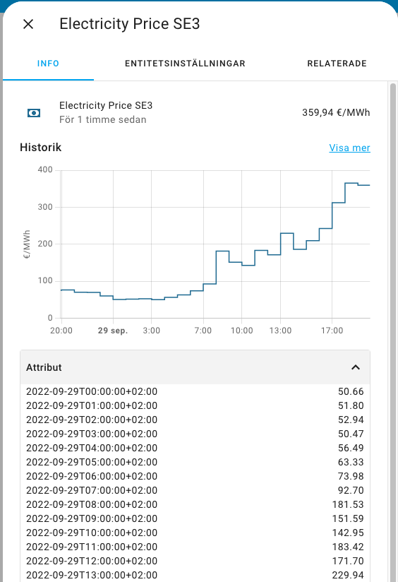
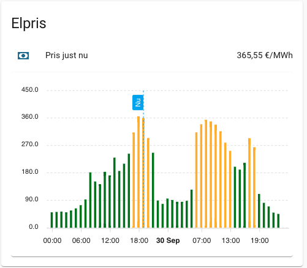

# Electricity Price integration for Home Assistant (ENTSO-E / Nordpool)
The [ENTSO-E](www.entsoe.eu) electricity price integration retrieves the **day ahead electricity prices** (spot price) from the *European Network of Transmission System Operators for Electricity* into **Home Assistant**. ENTSO-E is the association for the cooperation of the European transmission system operators (TSOs).

The data in ENTSO-E is the **same as from *Nordpool*** but unlike Nordpool, ENTSO-E provides an open API!

This integration gives you the hourly electricity prices for today and tomorrow (day ahead) as they are published by Nordpool via ENTSO-E. It is possible to...
 - Configure sensors that show the current electricity spot price.
 - Add markups to reflect the retail price that that your electricty reseller is charging you i.e. price incl. VAT and reseller's margin.
 - Convert the price to any currency using an sensor sensor containing the exchange rate or use a fixed rate.
 - Show the price for either MWh, kWh or Wh.

## Getting started
### Obtaining a ENTSO-E API token
To call the ENTSO-E API a token is needed. These are handed out free of charge but you have to register on the ENTSO-E site.

1. Goto the [ENTSO-E Transparency Platform](https://transparency.entsoe.eu).
2. Resgister on the ENTSO-E Transparency Platform. Click `Login` and chose to `Register`.
3. Login at least once! (ENTSO-E will **NOT** give you API access if you have not been logged in at least once.)
4. Request an API key by sending an e-mail to transparency@entsoe.eu with “Restful API access” in the subject line and nothing but you e-mail address in the e-mail body. You will receive an email when you have been provided with the API key. This usually goes quickly but can take up to three days.
5. Login to the transparency platform and goto [`My Account Settings`](https://transparency.entsoe.eu/usrm/user/myAccountSettings).
6. Click `Generate a new token` and copy the result.

### Installing the ENTSO-E integration
Copy the `entso_e` folder into your `config/custom-components` folder in you Home Assistant.

## Configuration
### Enable the integration
Enable the integration by adding the following to your `configuration.yaml`.

```yaml
entso_e:
    token: xxx-xxx-xxx-xxx
    areas:
      - SE3
      - SE4
```

| Option      | Description                                    |
| ----------- | ---------------------------------------------- |
| `token`     | The ENTSO-E API token that you can obtain by following the instructions above. |
| `areas`     | A list of price areas for which you want to retrieve the prices. The areas need to be listed here for them to be used by sensors later.|

### Creating a sensor

```yaml
sensor:
  # Spot price for SE3 in EUR per MWh
  - platform: entso_e
    area: SE3

  # Actual price, incl. retail markups, in SEK per kWh
  - platform: entso_e
    area: SE3
    friendly_name: Mitt elpris
    decimals: 2
    convert_uom_to: kWh
    convert_currency:
        to_currency: SEK
        exchange_rate: sensor.exrate_sek_to_eur
    markups:
      - friendly_name: Energy tax
        amount: 0.045
      - friendly_name: Retail price markup
        amount: 0.07
      - friendly_name: VAT
        percent: 25
```

| Option          | Description                                    |
| --------------  | ---------------------------------------------- |
| `area`          | One of the price areas that you specifed when enabling the integration. This is the price that your sensor will be based on |
| `friendly_name`  (optional) | A readable name that you want to give your sensor e.g., *Spot Price SE3* or *My current price*. |
| `decimals`  (optional) | The number of decimals you want to round the price to. If omitted all decimals will be shown. |
| `convert_uom_to`  (optional) | The energy unit of measure (UoM) that you want to present the price in. Allowed values are `MWh`, `kWh` and `Wh`. The field is case insensetive. If omitted ENTSO-E default UoM (`MWh`) will be used. |
| `convert_currency`  (optional) | Add this segment if you want to convert the price to another currency. If omitted ENTSO-E defualt (`EUR`) will be used. |
| `to_currency` | The currency to which you want to convert the price. This field is only to give the price the correct suffix e.g., `SEK/kWh`. |
| `exchange_rate` | **Fixed Exchange Rate** <br/> If the value of this field is a number (e.g `9.32`) this number will be used as the exchange rate from the ENTSO-E default currency (`EUR`). <br/><br/> **Dynamic Exchange Rate** <br/> If the vaue of this field is a *entity id* (e.g. `sensor.exrate_sek_to_eur`) the *state* of the entity will be used as a exchange rate. The electricity price sensor will be recalculated everytime the exchange rate sensor changes value. The [hass-ecb-exchange-rates](https://github.com/yxkrage/hass-ecb-exchange-rates/) is the recommended integration to use as exchange rate sensor. Note that the exchange rate sensor must exist before it can be used by the ENTSO-E integration. Add it before creating the `entso_e` sensor.|
| `markups`  (optional) | This segment makes it possible to add (or subtract) "markups" to the spot price retrieved from ENTSO-E (Nordpool) to e.g. reflect the true price that you as a customer pay. It is possible to add an arbitrary number of markups. The markups comes in two types, *amount* and *percent*, and they're added in order and calculated based on the result of the previous markup. **There is hence a big differnce in adding an amount markup before a percent or vice versa!** |
| `friendly_name`  (optional) | Only used for documentation in the `configuration.yaml` file. |
| `amount`  (optional, if omitted *percent* must exist) | An amount that should be added to the electricity price **after** the currency conversion and the unit of measure conversion have taken place. |
| `percent`  (optional, if omitted *amount* must exist) | An percentage that should be added to the electricity price **after** the currency conversion and the unit of measure conversion have taken place. |


## Visualizing the Day Ahead prices
In the extra attributes of the sensor the future Day Ahead prices for each hour are kept.



These can be used to plot the prices. One way to do this is to use the [ApexCharts card](https://community.home-assistant.io/t/apexcharts-card-a-highly-customizable-graph-card/272877).



The follow code produces the above graph. Add it to your `ui-lovelace.yaml`.

```yaml
entities:
  - type: 'custom:apexcharts-card'
    experimental:
        color_threshold: true
    graph_span: 48h
    span:
        start: day
    now:
        show: true
        label: 'Nu'
    series:
      - entity: sensor.electricity_price_se3
        stroke_width: 2
        type: column
        opacity: 1
        color_threshold:
          - value: 0
            color: green
          - value: 250
            color: '#fcba03'
          - value: 500
            color: red
        data_generator: |
            let data = entity.attributes;
            let ret = [];
            for (const [key, value] of Object.entries(data)) {
                ret.push([new Date(key).getTime(), value]);
            }
            return ret;
```

They `data_generator` segment retrieves the extra attributes from the electricity price sensor and presents them in a graph.